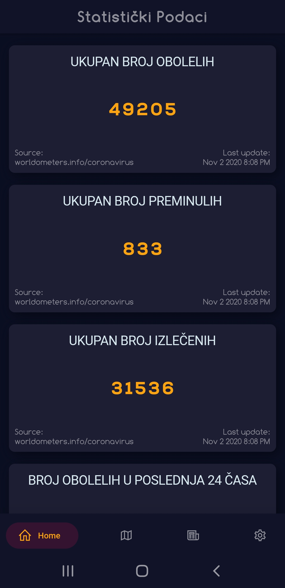
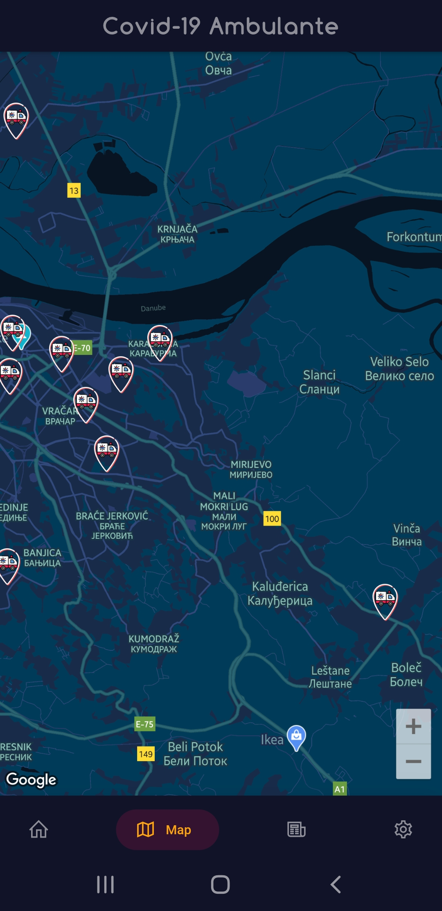
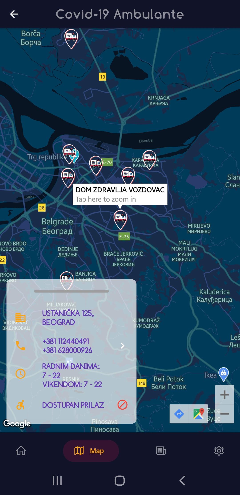

# c19_app_srb

Corona app to track cases, news and info about all registered COVID-19 ambulances in Serbia (RS), build with Flutter.

## Demo
Download the `app-release.apk` to try out the alpha version

 
<a href="https://github.com/StanisicS/korona_app/releases/download/v0.1-alpha/app-release.apk"></img></a>
 

## 📸 ScreenShots

 
|||
|||
 

## Getting Started

This project is a starting point for a Flutter application.

A few resources to get you started if this is your first Flutter project:

- [Lab: Write your first Flutter app](https://flutter.dev/docs/get-started/codelab)
- [Cookbook: Useful Flutter samples](https://flutter.dev/docs/cookbook)

For help getting started with Flutter, view our
[online documentation](https://flutter.dev/docs), which offers tutorials,
samples, guidance on mobile development, and a full API reference.
